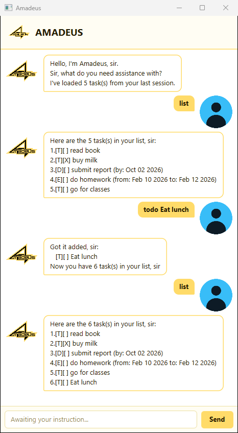

# Amadeus User Guide

Amadeus is a desktop chatbot that keeps track of your todos, deadlines, and events. It's
built for people who like typing over clicking: you talk to it in short commands, and it
replies with the same clipped, formal courtesy of a very organised personal assistant.



## Quick start

1. Make sure you have **JDK 25** installed.
1. Clone or download this repository, and open a terminal in its folder.
1. Build and run Amadeus:
   ```
   ./gradlew run
   ```
   (On Windows, use `gradlew.bat run` instead.)
1. A window titled "Amadeus" opens. Type a command into the box at the bottom and press
   Enter (or click Send) - try `list` to see your tasks, or `todo read book` to add one.
1. Your tasks are saved automatically after every change, in a `data/amadeus.txt` file
   next to where you ran Amadeus from, and loaded again the next time you start it.

## Features

> **Notes on the command format**
> - Words in `UPPER_CASE` are parameters you supply, e.g. in `todo DESCRIPTION`,
>   `DESCRIPTION` is yours to fill in - `todo read book`.
> - Commands are lower-case and must match exactly (`todo`, not `Todo`).
> - Task numbers are the ones shown by `list`, starting at 1.

### Adding a todo: `todo`

Adds a task with no date attached.

Format: `todo DESCRIPTION [#TAG...]`

Example: `todo read the tech blog #reading`
```
Got it added, sir:
   [T][ ] read the tech blog [#reading]
Now you have 1 task(s) in your list, sir
```

### Adding a deadline: `deadline`

Adds a task that's due by a particular date and, optionally, time.

Format: `deadline DESCRIPTION /by DATE`

Example: `deadline submit report /by 2019-10-15`
```
Got it added, sir:
   [D][ ] submit report (by: Oct 15 2019)
Now you have 2 task(s) in your list, sir
```

### Adding an event: `event`

Adds a task that runs from a start date/time to an end date/time.

Format: `event DESCRIPTION /from START /to END`

Example: `event team meeting /from 2019-08-06 1400 /to 2019-08-06 1600`
```
Got it added, sir:
   [E][ ] team meeting (from: Aug 06 2019, 2:00PM to: Aug 06 2019, 4:00PM)
Now you have 3 task(s) in your list, sir
```

> **Accepted date formats:** `2019-10-15`, `2019-10-15 1800`, `2/12/2019`, or
> `2/12/2019 1800`. The time (`1800` = 6pm) is always optional.

### Tagging a task

Add one or more `#word` tags anywhere in a `todo`, `deadline`, or `event` description to
label it - they're pulled out of the description and shown in brackets at the end.

Example: `todo call the dentist #health #urgent` → `[T][ ] call the dentist [#health, #urgent]`

### Listing all tasks: `list`

Shows every task, numbered in the order you added them.

Example: `list`
```
Here are the 3 task(s) in your list, sir:
1.[T][ ] read the tech blog [#reading]
2.[D][ ] submit report (by: Oct 15 2019)
3.[E][ ] team meeting (from: Aug 06 2019, 2:00PM to: Aug 06 2019, 4:00PM)
```

### Marking a task as done: `mark`

Format: `mark TASK_NUMBER`

Example: `mark 1`
```
Fantastic! I've marked this task as done, sir:
   [T][X] read the tech blog [#reading]
```

### Marking a task as not done: `unmark`

Format: `unmark TASK_NUMBER`

Example: `unmark 1`
```
OK, it has been marked as undone, sir:
   [T][ ] read the tech blog [#reading]
```

### Deleting a task: `delete`

Format: `delete TASK_NUMBER`

Example: `delete 2`
```
Fantastic! I've removed this task, sir:
   [D][ ] submit report (by: Oct 15 2019)
Now you have 2 task(s) in your list, sir
```

### Finding tasks by keyword: `find`

Shows every task whose description contains the given text (case-insensitive).

Format: `find KEYWORD`

Example: `find report`
```
Here are the matching tasks in your list, sir:
1.[D][ ] submit report (by: Oct 15 2019)
```

### Viewing tasks on a date: `on`

Shows every deadline or event that falls on the given day. Todos, having no date, never
match.

Format: `on DATE`

Example: `on 2019-10-15`
```
Here are the 1 task(s) on Oct 15 2019, sir:
1.[D][ ] submit report (by: Oct 15 2019)
```

### Exiting the program: `bye`

Says goodbye and closes the window a moment later.

Example: `bye`
```
Buh bye, sir
```

## Making a mistake

A command Amadeus doesn't recognise, or one that's missing something it needs (like a
task number, or a date it can't read), gets a plain-language explanation instead of
crashing - shown in a red-outlined box in the window so it stands out from an ordinary
reply. Nothing you typed is lost; just try the command again.

## Command summary

| Action | Format | Example |
|---|---|---|
| Todo | `todo DESCRIPTION [#TAG...]` | `todo read book #fun` |
| Deadline | `deadline DESCRIPTION /by DATE` | `deadline submit report /by 2019-10-15` |
| Event | `event DESCRIPTION /from START /to END` | `event meeting /from 2019-08-06 1400 /to 2019-08-06 1600` |
| List | `list` | `list` |
| Mark | `mark TASK_NUMBER` | `mark 1` |
| Unmark | `unmark TASK_NUMBER` | `unmark 1` |
| Delete | `delete TASK_NUMBER` | `delete 2` |
| Find | `find KEYWORD` | `find report` |
| On | `on DATE` | `on 2019-10-15` |
| Bye | `bye` | `bye` |

## Acknowledgements

Claude Code was used after handcoding a prototype, to help improve code structure and
catch edge cases that might otherwise have been missed.
